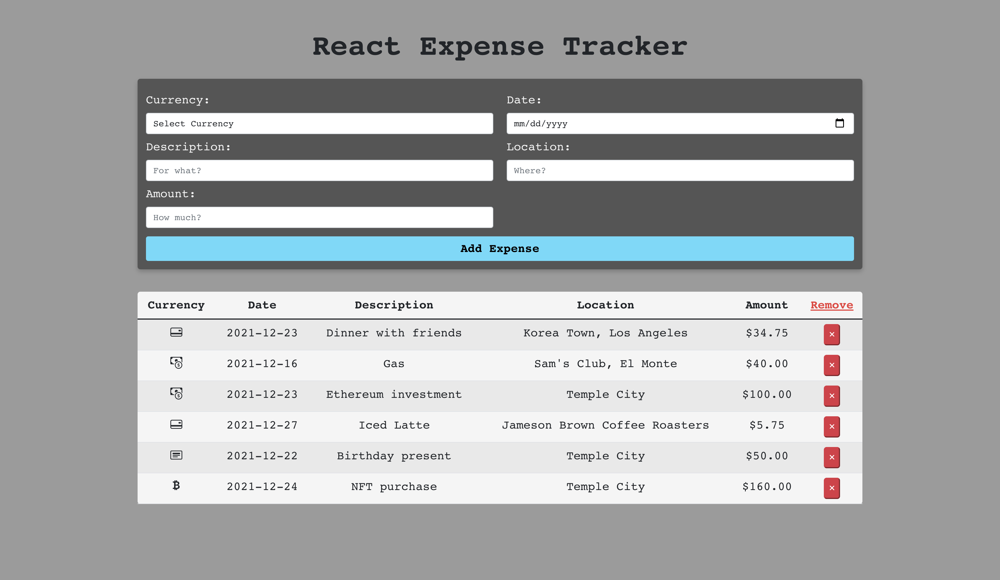

# ReactJS Expense Tracker

# Overview

- Expense Tracker application built with React JS and Bootstrap.
- Showcases several inputs for tabularly tracking your expenses.

# Website

- See it [here](https://reactjs-expense-tracker.herokuapp.com/) on Heroku! 

# Preview

# Summary

This is my first project using ReactJS and I thought it would be a good learning opportunity to rebuild my VanillaJS Expense Tracker using ReactJS and Bootstrap 5 for the styling. Before diving into remastering the old project, I did a bit of research on class and functional components. For this project I decided to use functional components as they were easier for me to understand as well as brought several benefits. With the addition of Hooks, I could implment state into my functional components to handle changes in user input. For me, the main goal of this project was about learning to "think in React" and getting the hang of the workflow React tries to encourage. After building this project I felt comfortable with the "top down" approach to state and have begun to understand how powerful the library is to Javascript and web developers. For styling, Bootstrap 5 was a breeze to work with and felt very user friendly. The create-react-app command helps to "bootstrap" the react application and helped my web application look stylish in a matter of minutes. Going forward, I am excited to use this combination for styling and discover more about what I can create with Bootstrap.  

- Detailed Features:
    - Utilized Bootstrap 5 for organized and responsive styling.
    - Used React JS to rebuild the first version of this application.
    - Managed state using functional components and hooks.
    - Used .map() technique for rendering expense rows.
    - Local storage feature allows users to retain logged expenses.

## Available Scripts

In the project directory, you can run:

### `npm start`

Runs the app in the development mode.\
Open [http://localhost:3000](http://localhost:3000) to view it in your browser.

The page will reload when you make changes.\
You may also see any lint errors in the console.

# Author

Brandon Chuck | Full-Stack Developer | [LinkedIn](https://www.linkedin.com/in/brandonchuck/) | [Personal Website](https://www.brandonchuck-dev.com)
